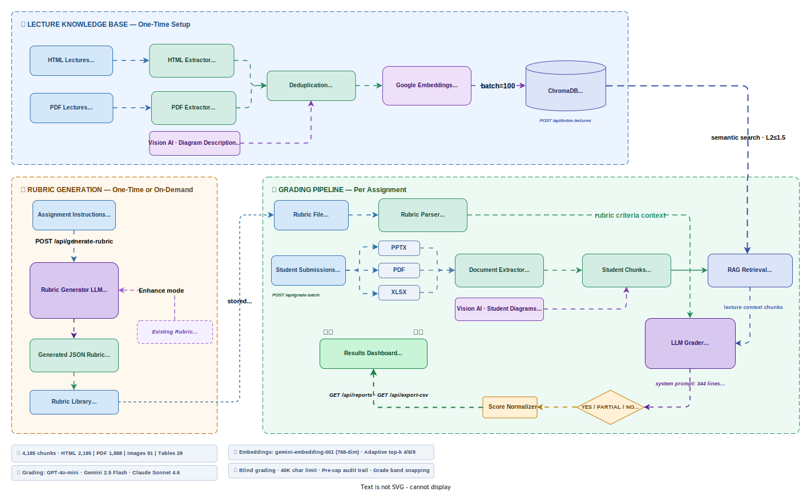

# GradeAI Pro — AI-Powered Auto Grader

> **Boston University MET CS / CDS · Spring 2026**  
> Automatically grade student PDF/PPTX/Excel submissions using Vision AI + RAG + LLM — with a simple web interface.

---

## Table of Contents

1. [What It Does](#what-it-does)
2. [Prerequisites](#prerequisites)
3. [Installation](#installation)
4. [Configuration — API Keys](#configuration--api-keys)
5. [Running the Web App](#running-the-web-app)
6. [Step-by-Step Workflow](#step-by-step-workflow)
   - [Step 1 — Upload & Describe Lectures](#step-1--upload--describe-lectures)
   - [Step 2 — Push Lectures to RAG](#step-2--push-lectures-to-rag)
   - [Step 3 — Upload Assignment & Rubric](#step-3--upload-assignment--rubric)
   - [Step 4 — Grade Student Submissions](#step-4--grade-student-submissions)
   - [Step 5 — View Reports & Export](#step-5--view-reports--export)
7. [Project Structure](#project-structure)
8. [Architecture Overview](#architecture-overview)
9. [CLI Reference (Advanced)](#cli-reference-advanced)
10. [For Future Developers](#for-future-developers)
11. [Troubleshooting](#troubleshooting)

---

## What It Does

GradeAI Pro is an end-to-end automated grading system that:

- **Reads student submissions** — PDF, PowerPoint, and Excel files including images and diagrams
- **Understands lecture content** — stores your lecture materials in a vector database (RAG)
- **Retrieves relevant context** — fetches matching lecture sections before grading each student
- **Grades against a rubric** — uses GPT-4o-mini / Gemini / Claude to evaluate each criterion
- **Generates PDF reports** — per-student grade breakdown with evidence and feedback
- **Exports to CSV** — all grades in one spreadsheet for your gradebook

---

## Prerequisites

Before you start, make sure the following are installed on your machine:

| Requirement | Version | How to get it |
|---|---|---|
| Python | 3.10 or newer | https://www.python.org/downloads/ |
| Git | any | https://git-scm.com/ |
| Tesseract OCR | 5.x | See below |
| At least one API key | — | OpenAI, Google Gemini, or Anthropic |

### Install Tesseract OCR

Tesseract is needed for reading scanned/image-based PDFs.

**macOS:**
```bash
brew install tesseract
```

**Ubuntu / Debian:**
```bash
sudo apt-get install tesseract-ocr
```

**Windows:**
Download the installer from https://github.com/UB-Mannheim/tesseract/wiki  
Then add Tesseract to your PATH.

---

## Installation

```bash
# 1. Clone the repository
git clone https://github.com/BU-Spark/ml-bu-autograder.git
cd ml-bu-autograder

# 2. Create a virtual environment
python3 -m venv .venv

# 3. Activate it
#    macOS / Linux:
source .venv/bin/activate
#    Windows:
.venv\Scripts\activate

# 4. Install all dependencies
pip install -r requirements.txt
```

> **Note:** The first install may take 2–3 minutes — ChromaDB and sentence-transformers are large packages.

---

## Configuration — API Keys

```bash
# Copy the template
cp .env.example .env
```

Now open `.env` in any text editor and fill in your keys:

```env
OPENAI_API_KEY=sk-...        # from platform.openai.com
GEMINI_API_KEY=AIza...       # from aistudio.google.com
ANTHROPIC_API_KEY=sk-ant-... # from console.anthropic.com
```

You only need **one** key to start grading. The app lets you pick the provider in the UI.

### Which embedding provider to choose?

Set `CHROMA_EMBEDDING_PROVIDER` in your `.env`:

| Value | What it uses | Cost | Best for |
|---|---|---|---|
| `google` | gemini-embedding-001 | ~free tier | Best quality (recommended) |
| `openai` | text-embedding-3-small | ~$0.00002/chunk | Good quality |
| *(empty)* | local all-MiniLM-L6-v2 | Free, no key | Offline / no cost |

> ⚠️ **Security:** `.env` is already in `.gitignore`. Never commit it to GitHub.

---

## Running the Web App

```bash
# Make sure your virtual environment is active
source .venv/bin/activate   # macOS/Linux
# .venv\Scripts\activate    # Windows

# Start the server
python scripts/web/app.py
```

Then open your browser at: **http://localhost:5000**

You should see the GradeAI Pro interface with three tabs:
- **Grade Submissions** — upload and grade student work
- **Manage Lectures** — upload and index lecture materials
- **Rubric & Setup** — manage assignments, rubrics, and quizzes

---

## Step-by-Step Workflow

This is the exact workflow for a professor using the system each semester.

---

### Step 1 — Upload & Describe Lectures

> Do this **once per semester** when you upload new lecture materials.

1. Go to the **Manage Lectures** tab
2. Click **Upload Lecture PDF** and upload your lecture PDFs (one at a time)
3. After uploading, click **Describe Lecture**
   - Select a Vision AI provider (OpenAI or Gemini recommended)
   - This reads every image and diagram in the PDF — takes 1–3 minutes per lecture
4. Repeat for all lecture modules

**What this does:** The system extracts text, tables, and images from each PDF, then uses Vision AI to describe every diagram and figure. This creates rich, searchable content.

---

### Step 2 — Push Lectures to RAG

> Do this **once** after describing all lectures.

1. Still on the **Manage Lectures** tab
2. Click **Index All Lectures into RAG**
   - This embeds all described lecture content into ChromaDB
   - Takes 1–5 minutes depending on how many lectures you have
3. You'll see a confirmation: *"Shared Chroma index is ready"*

**What this does:** All lecture chunks are embedded into a vector database. When grading, the system automatically retrieves the most relevant lecture sections for each student's work.

---

### Step 3 — Upload Assignment & Rubric

> Do this **once per assignment**.

1. Go to the **Rubric & Setup** tab
2. Under **Assignments**, click **Upload** and add your assignment PDF
   - Use the PDF version of the assignment (not a plain text file) for best results
3. Under **Rubrics**, click **Upload** and add your rubric
   - Supported formats: `.docx`, `.pdf`, `.txt`, `.json`
   - **Tip:** A DOCX rubric with a table (criterion | points | checklist items) gives the best grading results
4. Alternatively, click **Generate Rubric from Assignment** to have AI create a rubric from your assignment text

---

### Step 4 — Grade Student Submissions

1. Go to the **Grade Submissions** tab
2. Under **Files**, click **Add Files** and select student submissions
   - Supported: `.pdf`, `.pptx`, `.xlsx`
   - You can select multiple students at once for batch grading
3. Choose your settings:
   - **Grading Provider:** OpenAI (fast/cheap), Gemini, or Anthropic (most thorough)
   - **Assignment:** select the assignment you uploaded in Step 3
   - **Rubric:** select the rubric you uploaded in Step 3
4. Click **Grade**
5. Watch the progress log — grading takes about 1–3 minutes per student

**What happens behind the scenes:**
```
Upload → Extract text/images → Vision AI describes diagrams
  → Retrieve matching lecture context from RAG
    → LLM grades each rubric criterion
      → Apply policy caps → Generate PDF report
```

---

### Step 5 — View Reports & Export

1. After grading completes, click **View Report** next to any student to see their detailed PDF
2. Go to the **Reports** section to see all grading history
3. Click **Export CSV** to download all grades in a spreadsheet

Each PDF report includes:
- Overall score and total points
- Per-criterion scores with checklist evaluation
- Evidence quotes from the student's submission
- Any policy caps that were applied (e.g., missing diagram)

---

## Project Structure

```
ml-bu-autograder/
│
├── scripts/                        # All Python source code
│   ├── cli/
│   │   └── run_pipeline.py         # Main CLI — extract/describe/index/grade
│   ├── core/
│   │   ├── config.py               # Central config + env loading
│   │   ├── chunking.py             # Text chunking with overlap
│   │   └── pipeline.py             # Pipeline orchestration
│   ├── extractors/                 # PDF, PPTX, Excel, HTML extractors
│   ├── vision/                     # Vision AI wrappers + image tiling
│   ├── image_utils/                # OCR, image filtering, captions
│   ├── grading/
│   │   └── grade_submission.py     # Core grading engine (rubric → score)
│   ├── rubric_gen/                 # AI-powered rubric generation
│   ├── retrieval/
│   │   └── chroma_rag.py           # ChromaDB lecture index + retrieval
│   ├── storage/                    # ChromaDB persistence + JSONL writers
│   └── web/                        # Flask web application
│       ├── app.py                  # App factory + route registration
│       ├── config.py               # Web config + paths
│       ├── blueprints/             # Route handlers
│       │   ├── grading.py          # /api/grade, /api/grade-batch
│       │   ├── lecture.py          # /api/library/lectures, /api/index-lectures
│       │   ├── library.py          # /api/library/assignments|rubrics|quizzes
│       │   ├── rubric.py           # /api/generate-rubric
│       │   └── reports.py          # /api/history, /api/export-csv
│       ├── templates/              # HTML templates (Jinja2)
│       └── utils/
│           ├── pipeline.py         # Web → CLI subprocess bridge
│           ├── files.py            # File validation + safe paths
│           ├── pdf_generator.py    # Grade report PDF builder
│           └── web_scraper.py      # Web page text extraction
│
├── data/                           # Persistent user data (gitignored)
│   ├── library/
│   │   ├── assignments/            # Uploaded assignment files
│   │   ├── lectures/               # Uploaded lecture PDFs
│   │   ├── rubrics/                # Uploaded rubric files
│   │   └── quizzes/                # Uploaded quiz files
│   └── reports/                    # Generated PDF grade reports
│
├── outputs/                        # Pipeline run outputs (gitignored)
│   └── final_phase1/
│       ├── lecture_chunks_hybrid.jsonl   # Combined lecture chunks
│       └── <run_id>/                     # Per-run results
│           ├── extract/                  # Raw extraction
│           ├── describe_<provider>/      # Vision descriptions + chunks.jsonl
│           ├── retrieval.jsonl           # Lecture context matches
│           └── grading/grades.json       # Final scores
│
├── .env.example                    # API key template (safe to commit)
├── .env                            # Your actual keys (NEVER commit this)
├── requirements.txt                # Python dependencies
└── README.md                       # This file
```

---

## Architecture Overview

The full system design — including all 4 pipeline stages, API endpoints, and data flow — is shown below:



> **Four pipeline stages:**
> 1. **Lecture Knowledge Base** — HTML/PDF lecture ingestion → Vision AI diagram descriptions → Deduplication → Google Embeddings → ChromaDB (4,185 chunks)
> 2. **Rubric Generation** — Assignment instructions → `claude-sonnet-4-6` → JSON rubric with criteria + checklist (Generate or Enhance mode)
> 3. **Grading Pipeline** — Student PPTX/PDF/XLSX → Document Extractor + Vision AI → RAG Retrieval (top-8) → LLM grader (with optional few-shot calibration) → YES/PARTIAL/NO → grade-band mapping → policy caps → PDF Report + CSV
> 4. **Quiz Batch Grading** — Excel upload → Column detection → Per-cell LLM (with quiz-specific few-shot calibration) → Scored Excel output

### Few-shot Calibration

For assignments and quizzes where the LLM's default scoring diverges from human graders, **few-shot calibration** aligns the grader to expected scores by prepending scored exemplars to the system prompt.

**Quiz calibration file:** `scripts/grading/calibrations/quiz1_q13_bpr_system_prompt.txt`
- Contains human-scored example answers for Quiz 1, Question 13
- Loaded automatically when grading Quiz 1 Q13 via `--few-shot-file` flag or the web UI
- Edit the text file directly to add or adjust calibration examples — no code changes needed

To add calibration for a new quiz/question, create a new `.txt` file in `scripts/grading/calibrations/` and pass it via `--few-shot-file`.

### Grading Logic

The grading engine (`scripts/grading/grade_submission.py`) works as follows:

1. **Parse rubric** — extracts criteria, max points, and checklist items
2. **Evaluate checklist** — each item rated YES / PARTIAL / NO
3. **Calculate percentage** — `(yes + 0.67×partial) / total × 100`
4. **Snap to grade band** — maps percentage to a multiplier:

   | Checklist % | Multiplier |
   |---|---|
   | 90–100% | 1.000 × max points |
   | 83–89% | 0.967 × max points |
   | 76–82% | 0.900 × max points |
   | 68–75% | 0.750 × max points |
   | < 44% | 0.500 × max points |

5. **Apply policy caps** — prevents AI from awarding full marks when structural requirements are missing:
   - No workflow diagram found → cap at 78%
   - Missing required sections → deduct 10% per missing section
   - No evidence found for a criterion → cap that criterion at 60%

---

## CLI Reference (Advanced)

For running the pipeline without the web UI (automation, batch processing):

```bash
# All commands assume you are in the project root with .venv active

# ── Extract text/images from documents ───────────────────────────────────────
python scripts/cli/run_pipeline.py \
  --mode extract \
  --data-dir "path/to/student/submissions" \
  --output-root "outputs/final_phase1" \
  --run-id "run_01"

# ── Describe images with Vision AI ───────────────────────────────────────────
python scripts/cli/run_pipeline.py \
  --mode describe \
  --extract-dir "outputs/final_phase1/run_01/extract" \
  --describe-dir "outputs/final_phase1/run_01/describe_openai" \
  --vision-provider openai \
  --vision-model "gpt-4o-2024-11-20"

# ── Index lecture chunks into ChromaDB ───────────────────────────────────────
python scripts/cli/run_pipeline.py \
  --mode index \
  --chunks-jsonl "outputs/final_phase1/lecture_chunks_hybrid.jsonl" \
  --chroma-path "outputs/final_phase1/chroma_db" \
  --chroma-collection "lecture_v1"

# ── Retrieve lecture context for student chunks ───────────────────────────────
python scripts/cli/run_pipeline.py \
  --mode retrieve \
  --chunks-jsonl "outputs/final_phase1/run_01/describe_openai/chunks.jsonl" \
  --chroma-path "outputs/final_phase1/chroma_db" \
  --chroma-collection "lecture_v1" \
  --retrieval-out-jsonl "outputs/final_phase1/run_01/retrieval.jsonl" \
  --retrieval-top-k 6

# ── Grade a single student ────────────────────────────────────────────────────
python scripts/cli/run_pipeline.py \
  --mode grade \
  --chunks-jsonl "outputs/final_phase1/run_01/describe_openai/chunks.jsonl" \
  --retrieval-out-jsonl "outputs/final_phase1/run_01/retrieval.jsonl" \
  --student-path "Student_1.pdf" \
  --rubric-file "data/library/rubrics/my_rubric.docx" \
  --grading-provider openai \
  --grading-model "gpt-4o-mini"
```

### Environment Variables Quick Reference

| Variable | Default | Purpose |
|---|---|---|
| `OPENAI_API_KEY` | — | OpenAI API access |
| `GEMINI_API_KEY` | — | Google Gemini API access |
| `ANTHROPIC_API_KEY` | — | Anthropic Claude access |
| `CHROMA_EMBEDDING_PROVIDER` | *(local)* | `google`, `openai`, or empty |
| `AUTO_GRADER_RUBRIC_DIR` | `data/library/rubrics` | Default rubric folder |
| `FLASK_HOST` | `127.0.0.1` | Web server host |
| `FLASK_PORT` | `5000` | Web server port |
| `FLASK_DEBUG` | `0` | Enable Flask debug mode |

---

## For Future Developers

> This section is for students who will continue this project in future semesters.

### Handoff Notes — Spring 2026

#### What Was Built

This project was developed during **Spring 2026** at Boston University MET (CS/CDS). The following components are fully implemented and working:

| Component | Status | Notes |
|---|---|---|
| HTML + PDF lecture ingestion | ✅ Complete | BeautifulSoup + PyMuPDF, 142 HTML + 6 PDF modules |
| Vision AI diagram descriptions | ✅ Complete | OpenAI gpt-4o, Gemini, Claude with auto-tiling |
| ChromaDB RAG index | ✅ Complete | 4,185 chunks, L2≤1.5, Google/OpenAI/local embeddings |
| Rubric generation (AI) | ✅ Complete | claude-sonnet-4-6, Generate + Enhance modes |
| Student grading (PDF/PPTX/XLSX) | ✅ Complete | All 3 LLM providers, policy caps, grade bands |
| Quiz batch grading (Excel) | ✅ Complete | Fuzzy column detection, per-cell LLM, scored output |
| PDF grade reports | ✅ Complete | Per-criterion breakdown, evidence, policy cap log |
| CSV export | ✅ Complete | All grades in one spreadsheet |
| Flask web UI | ✅ Complete | 3-tab interface, batch grading, library management |

#### What Was NOT Built (Future Work)

- **No automated test suite** — unit tests for grading logic are the highest-priority gap
- **No authentication** — the web UI has no login; not suitable for public deployment without adding auth
- **No async job queue** — batch grading blocks the Flask worker; large batches (>10 students) may time out; consider Celery + Redis
- **No hosted deployment** — currently runs locally only; needs Gunicorn + Nginx or a cloud deployment for shared use
- **No plagiarism detection** — no cross-student comparison or similarity scoring
- **No grade appeal workflow** — grades are final; no UI for students to dispute

#### How to Start Efficiently (Next Team)

1. **Read this README end to end** — the full workflow is documented in [Step-by-Step Workflow](#step-by-step-workflow)
2. **Run the app locally first** — follow [Installation](#installation) and grade one sample student to see the full pipeline
3. **Read these two files** (the core of the system):
   - `scripts/grading/grade_submission.py` — rubric parsing, scoring, policy caps
   - `scripts/web/blueprints/grading.py` — how the UI triggers grading
4. **Check the dataset documentation** — see `dataset-documentation/DATASETDOC-sp26.md` for data provenance and structure
5. **Your first recommended tasks** (in order):
   - Add pytest tests for `grade_submission.py` (scoring math is critical to validate)
   - Add async job processing so batch grading doesn't block
   - Add a simple login page (Flask-Login) before any shared deployment

#### Where Key Data Lives

| Data | Location | Gitignored? |
|---|---|---|
| Lecture PDFs/HTMLs | `data/library/lectures/` | Yes |
| Student submissions | `data/library/assignments/` | Yes |
| Rubric files | `data/library/rubrics/` | Yes |
| ChromaDB vector index | `outputs/final_phase1/chroma_db/` | Yes |
| Grade PDF reports | `data/reports/` | Yes |
| Lecture chunks (JSONL) | `outputs/final_phase1/lecture_chunks_hybrid.jsonl` | Yes |
| API keys | `.env` | Yes — never commit |

All gitignored data directories are **auto-created** on first app startup.

---

### How to Add a New Grading Provider

1. Open `scripts/web/config.py`
2. Add an entry to the `PROVIDERS` dict:
   ```python
   "myprovider": {
       "label": "My Provider",
       "model": "my-model-name",
       "color": "#hex",
       "icon":  "myprovider",
   }
   ```
3. Add the API key env var to `PROVIDER_API_KEY_ENV`
4. In `scripts/grading/grade_submission.py`, extend the `_call_llm()` function to handle the new provider

### How to Add a New Document Format

1. Create `scripts/extractors/myformat_extractor.py` following the pattern in `pdf_extractor.py`
2. Export it from `scripts/extractors/__init__.py`
3. Add the file extension to `SUPPORTED_EXTENSIONS` in `scripts/core/config.py`
4. Add the extension to `STUDENT_ALLOWED_EXTS` in `scripts/web/config.py`

### How the Web App Calls the Pipeline

The web app **never imports the grading code directly**. Instead, blueprints in `scripts/web/blueprints/` call `_run()` from `scripts/web/utils/pipeline.py`, which launches `scripts/cli/run_pipeline.py` as a **subprocess**. This keeps the web process clean and allows the pipeline to run independently.

### Key Files to Understand First

| File | Why it matters |
|---|---|
| `scripts/cli/run_pipeline.py` | The central CLI — all 7 pipeline modes live here |
| `scripts/grading/grade_submission.py` | The grading engine — rubric parsing, scoring, policy caps |
| `scripts/web/config.py` | All paths and provider config — change defaults here |
| `scripts/retrieval/chroma_rag.py` | RAG indexing and retrieval |
| `scripts/web/blueprints/grading.py` | Web grading routes — how UI triggers the pipeline |
| `scripts/web/blueprints/lecture.py` | Lecture upload, describe, and RAG push flow |

### Running Tests

There is no automated test suite yet — this is a good first contribution for next semester students. Key areas to test:

- Rubric parsing (DOCX table, regex, AI fallback)
- Grade band snapping logic
- Policy cap application
- ChromaDB indexing and retrieval round-trip

### Recommended First Issues for Next Semester

- [ ] Add pytest unit tests for `grade_submission.py` scoring logic
- [ ] Add support for `.html` student submissions in the web UI
- [ ] Add a "re-grade with different model" button that preserves extraction
- [ ] Add email notification when batch grading completes
- [ ] Add a rubric quality checker (warns if rubric has no checklist items)
- [ ] Support multi-slide PPTX rubrics (currently only PDF/DOCX)

---

## Troubleshooting

### "Module not found" error on startup
Make sure your virtual environment is active:
```bash
source .venv/bin/activate   # macOS/Linux
.venv\Scripts\activate      # Windows
```
Then re-run `pip install -r requirements.txt`.

### Tesseract not found
Install Tesseract (see [Prerequisites](#prerequisites)) and make sure it's on your PATH:
```bash
tesseract --version   # should print version number
```

### Grading returns very low scores (below 40)
Check which assignment file is selected. A plain `.txt` file with strict rules will score much lower than the full assignment PDF. Always use the PDF version of the assignment.

### ChromaDB rate limit (429 error) when indexing
This happens with Google embeddings on large lecture sets. The system automatically batches with `--chroma-batch-size 20`. If it still fails, wait 60 seconds and retry.

### "Describe pipeline failed" in the web UI
This usually means a Vision API key is missing or the selected provider has no credits. Check your `.env` file and verify the key works at the provider's dashboard.

### Port 5000 already in use
```bash
FLASK_PORT=5001 python scripts/web/app.py
```
Or find and kill the process using port 5000:
```bash
lsof -i :5000          # macOS/Linux — find the PID
kill -9 <PID>
```

### Grades differ between runs
The LLM has slight non-determinism even at temperature=0. Small differences (±2 pts) are normal. Larger differences usually mean different assignment files were selected between runs.

---

## Built With

| Component | Technology |
|---|---|
| Web framework | Flask 3.x |
| Vector database | ChromaDB |
| PDF extraction | PyMuPDF + Camelot |
| OCR | Tesseract via pytesseract |
| Vision AI | OpenAI GPT-4o / Google Gemini / Anthropic Claude |
| Grading LLM | OpenAI GPT-4o-mini / Gemini 2.5 Flash / Claude Sonnet |
| Embeddings | Google gemini-embed / OpenAI text-embed-3-small / local MiniLM |
| Report PDF | fpdf2 |
| Language | Python 3.10+ |

---

*GradeAI Pro — Boston University MET · CS/CDS · Spring 2026*
