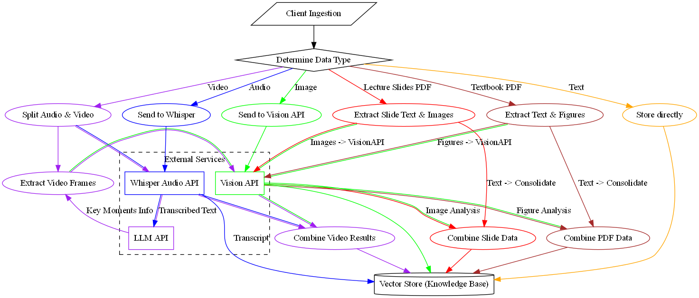
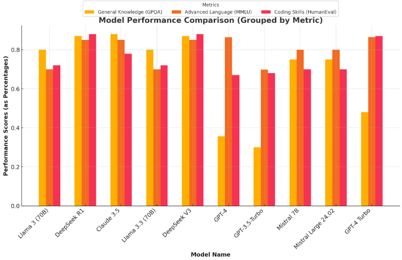
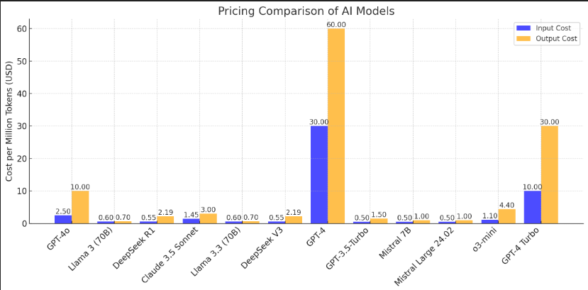

# Research Documentation

These research document contains the collective research of our team over the past few weeks. Our original research was compiled on Notion.

## Table of Contents
1. [Cost Analysis](#1-cost-analysis)
2. [Context Queries](#2-context-queries)
3. [Model Temperature for Consistency](#3-model-temperature-for-consistency)
4. [Retrieval-Augmented Generation (RAG)](#4-retrieval-augmented-generation-rag)
5. [Model Comparisons](#5-model-comparisons)
6. [College Exam Grader using LLM AI Models](#6-college-exam-grader-using-llm-ai-models)
7. [Other Relevant Papers](#7-other-relevant-papers)
8. [Other Relevant Projects (and Frameworks)](#8-other-relevant-projects-and-frameworks)

---

## 1. Cost Analysis

**Objective:**  
To determine the cost comparison between self-hosting an LLM via a cloud provider for inference purposes vs. using an API.

**Model:**  
DeepSeek-R1-Distill-Llama-70B (43GB VRAM requirement)  
- **GPUs:** NVIDIA RTX A6000 or A100  

**Token Output Estimates:**  
- A100: ~40-45 tokens/sec (estimated)  
- A6000: ~20-25 tokens/sec (estimated)  
- Actual tested performance on A6000: 12-13 tokens/sec  

**Cost Analysis:**  
- Spot VM pricing (GCP/Azure/Hyperstack):  
  - A100: ~$1.29/hr  
  - A6000: ~$0.50/hr  
- 1M tokens on A6000: ~$641 (at ~13 tokens/sec)

**Conclusion:**  
Using an API is significantly more cost-effective than self-hosting due to optimization expertise and economies of scale of API providers.

---

## 2. Context Queries

**Description:**  
Exploring how queries relying on previous conversation context can be processed cost-effectively across platforms.

**Findings:**  
- LLMs are stateless; they don't retain past conversation history between requests.  
- Previous conversation history must be resent with each new query for context continuity.  
- Optimizations include:
  - Summarizing past contexts.
  - Utilizing **Key-Value (KV) Caches** for efficient memory use.

**Resources:**  
- [Efficient Scaling with KV Caches (Research Paper)](https://arxiv.org/pdf/2211.05102)  
- [DeepSeek API Pricing](https://api-docs.deepseek.com/quick_start/pricing)  
- [LangChain Memory Blog](https://medium.com/@vinayakdeshpande111/how-to-make-llm-remember-conversation-with-langchain-924083079d95)

---

## 3. Model Temperature for Consistency

**Objective:**  
To test if setting temperature to zero removes grading inconsistencies.

**Findings:**  
- Lowering temperature improves consistency but doesn't fully eliminate randomness.  
- GPU rounding errors can introduce variability even with a temperature of zero.  
- Consistency improved by self-hosting LLMs (running on the same GPU setup).

**Discussion Threads:**  
- [OpenAI Randomness Discussion 1](https://community.openai.com/t/why-does-openai-api-behave-randomly-with-temperature-0-and-top-p-0/934104)  
- [OpenAI Randomness Discussion 2](https://community.openai.com/t/clarifications-on-setting-temperature-0/886447)

---

## 4. Retrieval-Augmented Generation (RAG)

**Description:**  
RAG combines LLMs with external knowledge retrieval for up-to-date and accurate responses.

**Advantages:**  
- No retraining required for knowledge updates.  
- Reduces hallucination risks by using curated data.  
- Enhances transparency by referencing sources.

**Workflow:**  
1. User query sent to a knowledge base.  
2. Relevant information retrieved.  
3. LLM generates output using the retrieved data.

**Our Current (very) W.I.P. RAG Pipeline:**

**Resources:**  
- [AWS - RAG Explanation](https://aws.amazon.com/what-is/retrieval-augmented-generation/)  
- [Azure - RAG Overview](https://azure.microsoft.com/en-us/resources/cloud-computing-dictionary/what-is-retrieval-augmented-generation-rag)  
- [RAG Research Paper](http://proceedings.mlr.press/v119/guu20a/guu20a.pdf)

---

## 5. Model Comparisons

Comprehensive site for crowdsourced human based ML model comparisons:
* https://lmarena.ai/

## 6. College Exam Grader using LLM AI Models

**Citation:**  
J. X. Lee and Y.-T. Song, "College Exam Grader using LLM AI models," 2024 IEEE/ACIS 27th International Conference on Software Engineering, Artificial Intelligence, Networking and Parallel/Distributed Computing (SNPD), Beijing, China, 2024, pp. 282-289, [DOI](https://doi.org/10.1109/SNPD61259.2024.10673924)

**Notes:**  
Our project will extend this research by exploring additional models not tested in their experiments. While they addressed variance in grading, especially for borderline cases, our work will focus on handling more complex and nuanced questions with advanced prompt and rubric engineering.

**Key Insights:**  
- **Models Used:** GPT-3.5, GPT-4.0, Gemini-Pro  
  - GPT-4.0 had the best consistency and lowest error rates across multiple grading experiments.  
- **Question Types:** Primarily focused on short-answer questions with objective grading metrics.  
- **Rubric Design:** Utilized conditional logic and set theory for accurate point allocation.  
- **Prompt Engineering:** Crafted prompts embedding the rubric and sample responses for one-shot learning with low randomness (temperature 0.2).  

**Experiments Summary:**  
1. **Mock-up Grading:** Tested variance across repeated evaluations.  
2. **Human vs. AI:** Compared grading accuracy and consistency, with GPT-4 outperforming humans in certain aspects.  
3. **Rephrased Responses:** Maintained scoring consistency across different phrasings of the same answer.  
4. **Actual Exam Grading:** Achieved 91.5% grading alignment with human TAs.

**Discussion:**  
- **Strengths:** GPT-4.0 demonstrated high reliability for objective grading tasks.  
- **Limitations:** Struggles with subjective questions and handling typos; also raises cost concerns for large-scale deployment.  

**CoGrader:**  
- A commercial AI grading platform primarily used in K-12 settings.  
- Supports custom rubrics and has a 30-day free trial for experimentation.  
- [CoGrader Website](https://cograder.com/)

## 7. Other Relevant Papers

- **Chain of Thought Prompting:** [Read Here](https://arxiv.org/abs/2201.11903)  
  - Chain of Thought Prompting is an important technique for self-consistency checks. And this is the foundational paper on that field.
- **Self-Consistency Improves Chain of Thought Reasoning:** [PDF](https://arxiv.org/pdf/2203.11171)
  - Helps enhance grading accuracy by rerunning reasoning paths and selecting the most consistent answer.
  - Similar to ensemble trees in that you re-run the same model several times and average results to improve the reliability of the output.
- **Other Grading Research Papers:**
  - Mok et al., 2024 - Physics grading using LLMs - [DOI](https://arxiv.org/html/2411.13685v1)
    - Provides a hands-on evaluation of AI grading in STEM subjects, applicable for testing the model's effectiveness in objective grading tasks.
  - Flodén, 2024 - AI vs. Human Grading - [DOI](https://doi.org/10.1002/berj.4069)
    - Highlights the strengths and weaknesses of AI-based grading compared to human assessment, which can guide benchmarking efforts for the project.
    - Whether current AI consistency matches human consistency in grading is for example an open question still.

---

## 8. Other Relevant Projects (and Frameworks)

### **Haystack for Knowledge Retrieval:** 
- Production ready RAG pipeline
- [Website](https://haystack.deepset.ai/)  

### AI-Handwrite-Grader by wongcyrus
- Grades handwritten submissions using AI  
- Accessible via GitHub CodeSpaces  
- [GitHub Repository](https://github.com/wongcyrus/AI-Handwrite-Grader)

### GradeAI by GradeAI
- Auto-grader using GPT-3.5, OCR, and Flask  
- Streamlines the grading process  
- [GitHub Repository](https://github.com/GradeAI/GradeAI)
