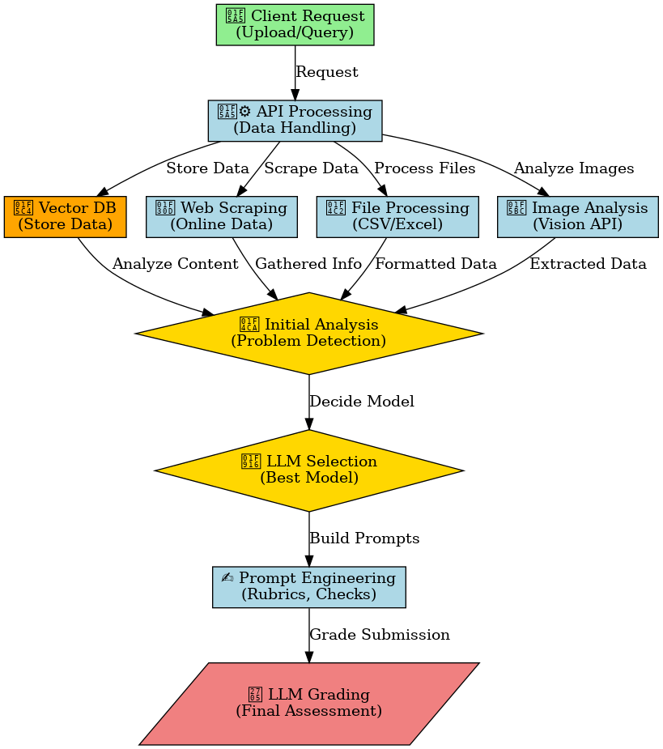

# MET BU Autograder - Technical Project Document 🚀

## *Josh Yip, Zach Gentile, Muhammad Aseef Imran, Fahim Uddin – 2025-February-15 vx.x.x-dev*

## 📝 Overview

The **AI-Assisted Grading Tool** for written answers and complex assignments is a project for **Boston University’s Metropolitan College Office of Education Technology and Innovation (MET ETI)**. This tool is designed to enhance grading consistency, accuracy, and alignment with instructor expectations for **CS 581 quizzes and assignments**.

The AI model will be capable of:

- Evaluating student responses.
- Processing supplemental course material.
- Supporting file-based grading.
- Ensuring cost-efficient API usage while maintaining high accuracy.

---

## A. Provide a solution in terms of human actions to confirm if the task is within the scope of automation through AI.

The task **is** within the scope of AI automation. MET ETI staff have already developed an AI model achieving **93% grading consistency**, proving its effectiveness. Our goal is to **enhance and improve this model** for better reliability and alignment with instructor expectations.

Further confirmation can be achieved by:

1. **Testing LLMs** with entire prompts and rubrics to validate their ability to grade accurately.
2. **Comparing AI-graded results** with human-graded results for benchmarking.
3. **Running pilot testing** to assess grading stability and fairness across multiple assignments.

### ✅ Current Process (Manual Grading):

1. A CS 581 student submits a quiz or assignment in **Blackboard**.
2. The **instructor or TA manually grades** responses using rubrics and sample correct answers.
3. The **grade is entered** into Blackboard.
4. A **review is conducted** for consistency across multiple graders.

### 🤖 AI-Assisted Process:

1. A student submits a quiz or assignment.
2. The response is **sent via API to the AI model**.
3. The AI **grades the response** using:
   - Predefined **rubrics** 📜
   - Sample answers ✅
   - Supplemental **course material** 📂
4. The AI **returns a structured response**, including a **score & explanation**.
5. The **instructor reviews and confirms** the AI’s evaluation before **finalizing the grade**.
6. AI-graded responses are **logged for consistency analysis** 📊.

---

## B. Problem Statement

The primary challenge is ensuring **consistency, accuracy, and reliability** in AI-assisted grading for **short-answer quizzes and file-based assignments**. The AI model must:

- Extract **clear scores and justifications**.
- Reference **structured supplemental data** (e.g., rubrics, external materials, PDFs, and slides).
- Support **various file types**.
- Potentially **retrieve relevant external information** (e.g., web browsing and document parsing capabilities).

---

## C. Checklist for Project Completion

To define the **successful completion** of this project, we aim to deliver:

### 🎯 Core Deliverables:

- **Optimal AI platform** for MET ETI’s use case.
  - 🔹 **Documentation**: Setup instructions, environment access, API usage.
- **Optimal AI model** tailored for grading.
  - 🔹 **Documentation**: API usage, fine-tuning instructions.
- **Efficient method for adding course materials** (RAG-based document retrieval & storage).
  - 🔹 **Guidelines** on integrating **PDFs, slides, videos**.
- **Performance metrics & evaluation reports** 📈.
  - 🔹 **Improvement summary** of AI auto-grading performance for CS 581.

---

## D. Outline a Path to Operationalization

The problem at hand is improving the consistency, accuracy, and reliability of AI-assisted grading for short-answer quizzes and file-based assignments. The AI model must extract a clear score and justification while referencing structured supplemental data, rubrics, and student-uploaded files. The solution should also support file processing, external links, and potential web browsing capabilities for retrieving relevant material. The goal is to deliver a **production-ready API**. The final deployment strategy includes:

### 🌐 **Integration with Blackboard & LMS systems**

- API endpoints to **automate quiz & assignment grading**.
  - FastAPI has built in tools to create documentation for your API with low-effort which we intend to utilize.
- (Time Permitting) Web-based dashboard for **grading logs & analytics**.

### ☁️ **Deployment Strategy**

- **Cloud-based API** hosted on **Azure / FastAPI backend**.
- **Database & vector storage** for **retrieval-augmented grading**.
  - *Note, which vector database or whether this vector database would be required even still requires more research.*
- **API Authentication & security layers** to protect student data.

### 🔗 **Long-Term Maintenance Plan**

- Clear **documentation** for using the Grading Tool's API.
- Pipeline for **future AI model upgrades**.
- **Feedback loop** for improving grading accuracy.

---

## 📊 Workflow Diagram

Below is a visual representation of the MET BU Autograder workflow:

This diagram provides a (preliminary) step-by-step breakdown of how requests flow through the system, from initial submission to AI-assisted grading.

---

## 📂 Resources

### 📊 Data Sets

- 📝 **Student responses** from CS 581 quizzes & assignments.
- 📑 **Instructor-provided rubrics & sample answers**.
- 📚 **Supplementary course materials** (PDFs, slides, videos).

### 📖 References

- 📄 **MET ETI AI-Assisted Grading Requirements Document**.
- 📌 **Azure Documentation**.
- 🤖 **GPT-4o, Claude, LLaMA, DeepSeek, Grok3 API Docs**.

---

## 🗓️ Weekly Meeting Updates

Ongoing meetings and updates will be tracked in the **Project Description Document** prepared by **Spark staff** for this project.

